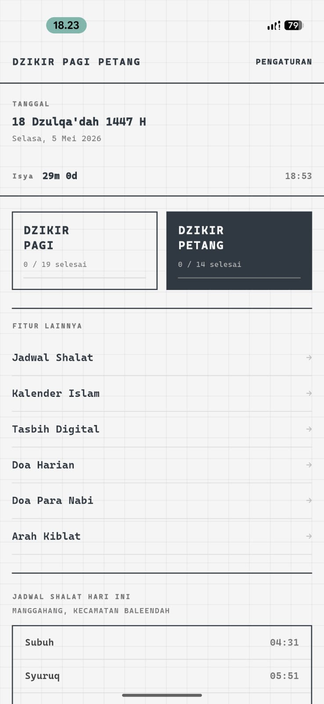
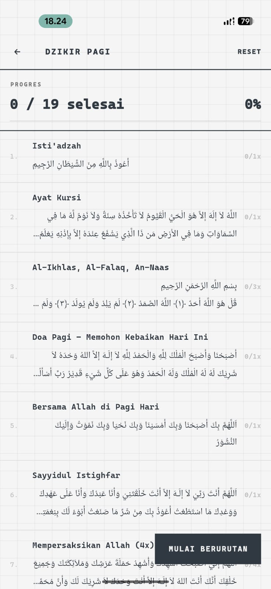
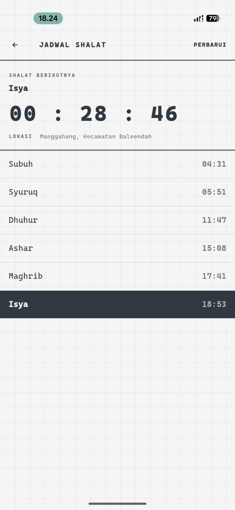
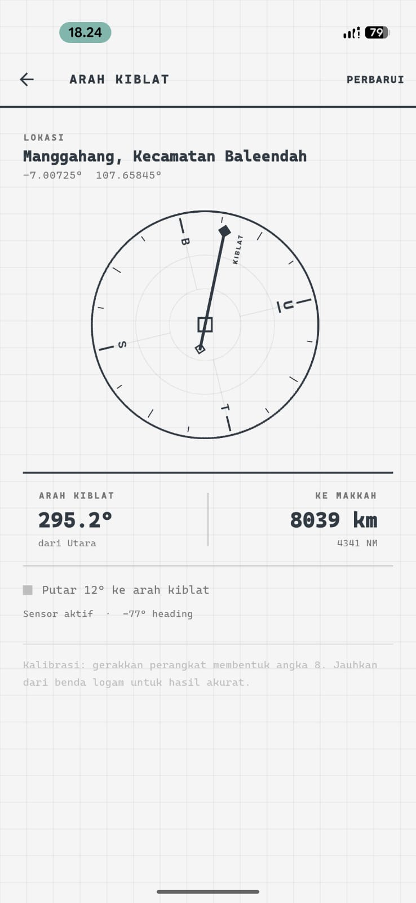
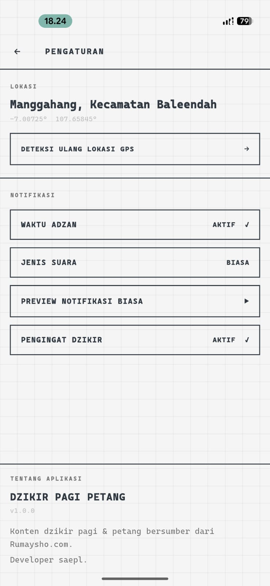

# Dzikir Pagi & Petang

Aplikasi Flutter untuk membantu pengguna membaca dzikir pagi dan petang, melihat jadwal shalat, menerima pengingat adzan, menggunakan tasbih digital, mengecek arah kiblat, serta membaca kumpulan doa harian dalam satu pengalaman yang ringan dan rapi.

<p align="center">
  
</p>

## Preview

| Beranda | Dzikir Pagi | Dzikir Petang |
| --- | --- | --- |
|  |  |  |

| Jadwal Shalat | Arah Kiblat | Pengaturan |
| --- | --- | --- |
|  |  |  |

## Fitur Utama

- Dzikir pagi dan petang dengan counter per bacaan.
- Reset progres harian otomatis agar dzikir setiap hari dimulai bersih.
- Notifikasi dzikir pagi pukul 06:00 sampai 08:00 setiap 30 menit.
- Notifikasi dzikir petang pukul 16:00 sampai 17:30 setiap 30 menit.
- Notifikasi pengingat adzan 10 menit sebelum waktu shalat.
- Notifikasi waktu shalat dengan pilihan suara adzan atau notifikasi biasa.
- Preview suara adzan, adzan subuh, dan notifikasi biasa.
- Preview audio otomatis berhenti saat pengguna keluar dari halaman pengaturan atau aplikasi masuk background.
- Jadwal shalat berdasarkan koordinat lokasi pengguna.
- Deteksi lokasi dan nama kota melalui GPS.
- Arah kiblat dan estimasi jarak ke Makkah.
- Tasbih digital.
- Doa harian, doa nabi, dan kalender Islam.
- Logo aplikasi, splash screen, launcher icon, dan ikon notifikasi memakai aset logo yang konsisten.

## Penyimpanan Lokal

Aplikasi menggunakan database lokal SQLite melalui `sqflite` untuk menyimpan state pengguna secara permanen di perangkat.

Data yang tersimpan lokal:

- progres counter dzikir pagi dan petang;
- status selesai dzikir harian;
- tanggal reset harian;
- lokasi terakhir dan nama kota;
- metode perhitungan jadwal shalat;
- status aktif/nonaktif notifikasi adzan dan dzikir;
- pilihan suara adzan atau notifikasi biasa;
- total tasbih;
- ukuran font Arab;
- status first launch aplikasi.

Data lama dari `SharedPreferences` dimigrasikan otomatis ke SQLite pada inisialisasi pertama, sehingga progres pengguna yang sudah ada tetap aman.

## Teknologi

- Flutter
- Provider
- SQLite lokal dengan `sqflite`
- SharedPreferences untuk migrasi data lama
- `flutter_local_notifications`
- `timezone` dan `flutter_timezone`
- `adhan`
- `geolocator` dan `geocoding`
- `audioplayers`
- `hijri`

## Struktur Project

```text
lib/
  core/                 Theme dan warna aplikasi
  data/                 Konten dzikir, doa, dan kalender
  providers/            AppProvider untuk state utama aplikasi
  screens/              Halaman aplikasi
  services/             Storage, notifikasi, jadwal shalat, dan kiblat
  widgets/              Widget reusable
assets/
  audio/                Audio adzan dan suara notifikasi
  fonts/                Font aplikasi
  images/               Logo dan aset gambar
android/                Konfigurasi Android
ios/                    Konfigurasi iOS
web/                    Konfigurasi Flutter Web
website-dzikirpagi/     Aset preview dan landing page pendukung
```

## Persyaratan

- Flutter SDK terbaru yang kompatibel dengan Dart `^3.11.1`
- Android Studio atau Xcode sesuai target platform
- Perangkat/emulator Android untuk menguji notifikasi, lokasi, dan audio

## Instalasi

```bash
flutter pub get
```

Jalankan aplikasi:

```bash
flutter run
```

Build APK debug:

```bash
flutter build apk --debug
```

Build APK release:

```bash
flutter build apk --release
```

## Generate Icon dan Splash

Launcher icon dan native splash menggunakan `logo.png` di root project.

```bash
dart run flutter_launcher_icons
dart run flutter_native_splash:create
```

## Permission Android

Aplikasi menggunakan permission berikut:

- lokasi foreground dan background untuk jadwal shalat dan arah kiblat;
- notifikasi untuk pengingat dzikir dan adzan;
- exact alarm untuk jadwal notifikasi yang presisi;
- vibrasi dan wake lock untuk kualitas notifikasi.

Pada Android 13 ke atas, izin notifikasi harus diberikan oleh pengguna. Pada beberapa perangkat Android 12 ke atas, izin exact alarm juga dapat membutuhkan persetujuan dari pengaturan sistem.

## Catatan Pengembangan

- Jangan commit folder build cache seperti `.dart_tool/`, `build/`, `node_modules/`, atau `android/.kotlin/`.
- Jangan commit file log hasil analyzer atau build manual.
- Setelah mengubah aset logo, jalankan ulang generator icon dan splash.
- Setelah mengubah notifikasi, uji langsung di perangkat Android karena emulator dan mode battery saver dapat memengaruhi exact alarm.

## Status

Project ini berfokus pada pengalaman dzikir harian yang sederhana, offline-friendly, dan konsisten. Data pengguna disimpan lokal di perangkat, sehingga aplikasi tetap dapat digunakan tanpa akun.
